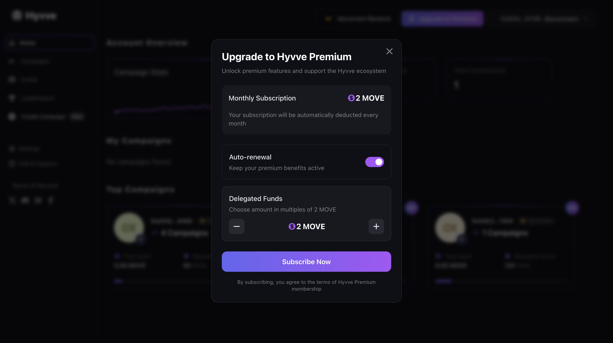

# Subscription Management

As a campaign creator on Hyvve, you can access premium features through our subscription system. This guide explains how subscriptions work and how to manage them effectively.

## Understanding Hyvve Subscriptions

Hyvve offers a premium subscription that gives campaign creators enhanced capabilities for managing data campaigns:

### Subscription Benefits

- **Image-Based Campaigns**: Create and manage image data collection campaigns (exclusive to premium)
- **Higher Campaign Limits**: Create more campaigns simultaneously
- **Advanced Analytics**: Access detailed insights about your data contributions
- **Priority Verification**: Faster verification times for your campaigns
- **Premium Support**: Direct access to the Hyvve support team
- **Enhanced Visibility**: Featured placement in the campaign marketplace

### Subscription Details

- **Duration**: Subscriptions run for 30 days at a time
- **Cost**: 2 MOVE per month (200,000,000 units)
- **Renewal**: Can be set to automatically renew each month
- **Payment**: Processed through your connected movement compatible wallet

## Managing Your Subscription

### Starting a Subscription

To create a new subscription:

1. Navigate to **Home** in your account
2. Click the "Activate Subscription" button
3. A subscription modal will appear showing:

   - Monthly subscription cost (2 MOVE)
   - Subscription features
   - Auto-renewal toggle switch

4. If you only want a one-month subscription:

   - Leave the auto-renewal toggle OFF
   - Click "Confirm Payment"

5. If you want to set up auto-renewal:

   - Toggle the auto-renewal switch to ON
   - A delegated payment counter will appear, starting at 2 MOVE
   - Use the "+" button to increase the amount in increments of 2 MOVE (e.g., 4, 6, 8 MOVE)
   - Each increment adds one month of pre-funded renewal
   - Choose how many months you want to pre-fund
   - Click "Confirm Payment"

6. Complete the transaction through your connected wallet
7. Your subscription will activate immediately

### Managing Delegated Payments

Your delegated payment balance is used automatically for renewals. If you need to add more funds later:

1. Go to **Dashboard > Subscription > Manage Payment**
2. You'll see your current delegated payment balance
3. Click "Add Funds"
4. A counter will appear starting at 2 MOVE
5. Use the "+" button to increase in increments of 2 MOVE
6. Select the amount you want to add
7. Complete the transaction through your wallet

The added funds will be available for future auto-renewals.

### Checking Subscription Status

To view your current subscription:

1. Visit **Profile**
2. You'll see:
   - Current status (Active/Inactive)
   - End date
   - Subscription type
   - Auto-renewal setting
   - Delegated payment balance (if applicable)

## Auto-Renewal System

### How Auto-Renewal Works

When you enable auto-renewal:

1. Our system checks your subscription status every 12 hours
2. When your subscription reaches its end date, it automatically processes the renewal
3. If you've set up delegated payments, the renewal fee is deducted from your pre-funded balance
4. If no delegated payment is available, the renewal will attempt to process through your wallet
5. You'll receive a notification confirming successful renewal

### Potential Renewal Issues

Auto-renewals may fail for several reasons:

- **Insufficient Balance**: Not enough funds in your delegated payment store or wallet
- **Missing Payment Capability**: Delegated payment was not set up or has been depleted
- **Wallet Disconnect**: Your wallet is no longer connected to the platform

If auto-renewal fails:

1. Your subscription will be deactivated
2. You'll receive a notification explaining why the renewal failed
3. You can reactivate by manually renewing from your dashboard

## Subscription FAQ

**Q: Can I upgrade or change my subscription type?**  
A: Currently, Hyvve offers a single premium tier. Additional tiers may be available in the future.

**Q: What happens to my active campaigns if my subscription expires?**  
A: Active campaigns will continue to run until their completion, but you won't be able to create new image-based campaigns until you renew your subscription. Text-based campaigns will still be available with the free tier.

**Q: Can I get a refund if I cancel early?**  
A: Subscriptions are non-refundable for partial periods. Your subscription will remain active until the end of the current billing cycle.

**Q: Can I temporarily pause my subscription?**  
A: Currently, subscriptions cannot be paused. You can cancel and resubscribe when needed.

## Benefits of Premium Subscription

### Campaign Management Benefits

| Feature                | Basic           | Premium                          |
| ---------------------- | --------------- | -------------------------------- |
| Campaign types         | Text-based only | Text and Image-based campaigns   |
| Simultaneous campaigns | 2               | Unlimited                        |
| Data export formats    | Basic (CSV)     | Advanced (CSV, JSON, customized) |
| Campaign visibility    | Standard        | Featured placement               |
| Verification speed     | Standard        | Priority queue                   |

### Analytics Benefits

| Feature              | Basic   | Premium                         |
| -------------------- | ------- | ------------------------------- |
| Contribution metrics | Basic   | Advanced with insights          |
| Historical data      | 30 days | Unlimited                       |
| Export capabilities  | Limited | Full export with custom queries |
| Real-time updates    | Delayed | Instant                         |

### Technical Implementation Details

For those interested in the technical aspects, our subscription system uses a hybrid on-chain/off-chain approach:

- **On-Chain Components**: Secure payment processing, subscription state management, and verification of subscription status
- **Off-Chain Automation**: Scheduled checks for subscription renewals, notifications, and analytics

This ensures that your subscription management is both secure and user-friendly, leveraging the best of blockchain technology while maintaining a seamless user experience.
